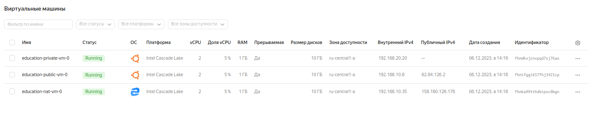

# Решение домашнего задания к занятию «Организация сети»

### Задание 1. Yandex Cloud 

**Что нужно сделать**

1. Создать пустую VPC. Выбрать зону.
2. Публичная подсеть.
 - Создать в VPC subnet с названием public, сетью 192.168.10.0/24.
 - Создать в этой подсети NAT-инстанс, присвоив ему адрес 192.168.10.254. В качестве image_id использовать fd80mrhj8fl2oe87o4e1.
 - Создать в этой публичной подсети виртуалку с публичным IP, подключиться к ней и убедиться, что есть доступ к интернету.
3. Приватная подсеть.
 - Создать в VPC subnet с названием private, сетью 192.168.20.0/24.
 - Создать route table. Добавить статический маршрут, направляющий весь исходящий трафик private сети в NAT-инстанс.
 - Создать в этой приватной подсети виртуалку с внутренним IP, подключиться к ней через виртуалку, созданную ранее, и убедиться, что есть доступ к интернету.

### Решение

Создан манифест [main.tf](src/main.tf),
в котором описана: 
- [VPC](https://github.com/fedor-metsger/clopro-homeworks/blob/5774c9e0ad486c306208a6e95ea99d1426d2e3b1/src/main.tf#L2)
- публичная подсеть [public](https://github.com/fedor-metsger/clopro-homeworks/blob/5774c9e0ad486c306208a6e95ea99d1426d2e3b1/src/main.tf#L11)
- приватная подсеть [private](https://github.com/fedor-metsger/clopro-homeworks/blob/5774c9e0ad486c306208a6e95ea99d1426d2e3b1/src/main.tf#L23)
- NAT инстанс [nav-vm](https://github.com/fedor-metsger/clopro-homeworks/blob/5774c9e0ad486c306208a6e95ea99d1426d2e3b1/src/main.tf#L49)
- виртуалка с публичным IP [public-vm](https://github.com/fedor-metsger/clopro-homeworks/blob/5774c9e0ad486c306208a6e95ea99d1426d2e3b1/src/main.tf#L31)
- таблица маршрутизации [nat-rt](https://github.com/fedor-metsger/clopro-homeworks/blob/5774c9e0ad486c306208a6e95ea99d1426d2e3b1/src/main.tf#L105)
- виртуалка без публичного IP [private-vm](https://github.com/fedor-metsger/clopro-homeworks/blob/5774c9e0ad486c306208a6e95ea99d1426d2e3b1/src/main.tf#L69)

Выполнение команд:
- Инициализация **terraform**:
```
fedor@fedor-X99-F8:~/CODE/Netology/DevOps/clopro-homeworks/src$ terraform init

Initializing the backend...
Initializing modules...
Downloading git::https://github.com/fedor-metsger/yandex_compute_instance.git?ref=main for nat-vm...
- nat-vm in .terraform/modules/nat-vm
Downloading git::https://github.com/fedor-metsger/yandex_compute_instance.git?ref=main for private-vm...
- private-vm in .terraform/modules/private-vm
Downloading git::https://github.com/fedor-metsger/yandex_compute_instance.git?ref=main for public-vm...
- public-vm in .terraform/modules/public-vm

Initializing provider plugins...
- Reusing previous version of yandex-cloud/yandex from the dependency lock file
- Reusing previous version of hashicorp/template from the dependency lock file
- Using previously-installed yandex-cloud/yandex v0.103.0
- Using previously-installed hashicorp/template v2.2.0

Terraform has been successfully initialized!

You may now begin working with Terraform. Try running "terraform plan" to see
any changes that are required for your infrastructure. All Terraform commands
should now work.

If you ever set or change modules or backend configuration for Terraform,
rerun this command to reinitialize your working directory. If you forget, other
commands will detect it and remind you to do so if necessary.
fedor@fedor-X99-F8:~/CODE/Netology/DevOps/clopro-homeworks/src$
```
- Создание объектов:
```
fedor@fedor-X99-F8:~/CODE/Netology/DevOps/clopro-homeworks/src$ terraform apply
data.template_file.userdata: Reading...
data.template_file.userdata: Read complete after 0s [id=370851be8c96b0c465cd9a97bffc38bec2bab5827c686c34c473ccab51781d06]
module.nat-vm.data.yandex_compute_image.my_image: Reading...
module.public-vm.data.yandex_compute_image.my_image: Reading...
module.private-vm.data.yandex_compute_image.my_image: Reading...
module.nat-vm.data.yandex_compute_image.my_image: Read complete after 4s [id=fd83qk2ghvdjggu4m84v]
module.private-vm.data.yandex_compute_image.my_image: Read complete after 4s [id=fd839i1233e8krfrf92s]
module.public-vm.data.yandex_compute_image.my_image: Read complete after 4s [id=fd839i1233e8krfrf92s]

Terraform used the selected providers to generate the following execution plan. Resource actions are indicated with the following symbols:
  + create

Terraform will perform the following actions:

  # yandex_vpc_network.net will be created
  + resource "yandex_vpc_network" "net" {
      + created_at                = (known after apply)
      + default_security_group_id = (known after apply)
      + folder_id                 = (known after apply)
      + id                        = (known after apply)
      + labels                    = (known after apply)
      + name                      = "lab"
      + subnet_ids                = (known after apply)
    }

  # yandex_vpc_route_table.nat-rt will be created
  + resource "yandex_vpc_route_table" "nat-rt" {
      + created_at = (known after apply)
      + folder_id  = (known after apply)
      + id         = (known after apply)
      + labels     = (known after apply)
      + name       = "nat-rt"
      + network_id = (known after apply)

      + static_route {
          + destination_prefix = "0.0.0.0/0"
          + next_hop_address   = (known after apply)
        }
    }

  # yandex_vpc_security_group.nat-sg will be created
  + resource "yandex_vpc_security_group" "nat-sg" {
      + created_at = (known after apply)
      + folder_id  = (known after apply)
      + id         = (known after apply)
      + labels     = (known after apply)
      + name       = "nat-sg"
      + network_id = (known after apply)
      + status     = (known after apply)

      + egress {
          + description    = "any"
          + from_port      = -1
          + id             = (known after apply)
          + labels         = (known after apply)
          + port           = -1
          + protocol       = "ANY"
          + to_port        = -1
          + v4_cidr_blocks = [
              + "0.0.0.0/0",
            ]
          + v6_cidr_blocks = []
        }

      + ingress {
          + description    = "any"
          + from_port      = -1
          + id             = (known after apply)
          + labels         = (known after apply)
          + port           = -1
          + protocol       = "ANY"
          + to_port        = -1
          + v4_cidr_blocks = [
              + "0.0.0.0/0",
            ]
          + v6_cidr_blocks = []
        }
    }

  # module.nat-vm.yandex_compute_instance.vm[0] will be created
  + resource "yandex_compute_instance" "vm" {
      + allow_stopping_for_update = true
      + created_at                = (known after apply)
      + description               = "TODO: description; {{terraform managed}}"
      + folder_id                 = (known after apply)
      + fqdn                      = (known after apply)
      + gpu_cluster_id            = (known after apply)
      + hostname                  = "education-nat-vm-0"
      + id                        = (known after apply)
      + labels                    = {
          + "env"     = "education"
          + "project" = "undefined"
        }
      + metadata                  = {
          + "serial-port-enable" = "1"
          + "user-data"          = <<-EOT
                #cloud-config
                users:
                  - name: user
                    groups: sudo
                    shell: /bin/bash
                    sudo: ['ALL=(ALL) NOPASSWD:ALL']
                    ssh-authorized-keys:
                      - ssh-rsa AAAAB3NzaC1yc2EAAAADAQABAAABgQDmAQm4S2bJ8BP+Cj+9JNcAQcGhhieeYwcxglNJN7+zDvZhg/7PsxcdYWKcwuQEP6Eu7LylGyKIoMMM1nJ/xojJx6p4mkMbNZI239Bkju5+pej0OJSCPTZjMTsOp0RkGmeMuvFEE89MsGCU1hf6AZwBR5Jtn4SrHS5GAXwxgNA6zK/BcI7fhNflhMIcfvBYq1+y/s5f6EniUTMtijIW3aWVr4rdWKsznlTkQpPlI2Rr6Qzy5OsoS2gk0+rFD2V7rzVe9Djplp5taxqVY1oA0MpoqM10gQoxaY12GIK0WElMMjFzeysV21IdI345015tTmXxS2EVryUrWsS4BryhbnansDUgihI1Sr5kKeEeK9d3Wqi6uFDcDwizB3Cne7dr0RpT+7gpbvTMyM6AB1ON3MrE28GDUNjTlaEgRyRvYynIx/bEVIO+XvBDUt2oQdG7dbGPcWppfjkAkJsVcfSRamwSEoD0c5BmJAcp9ez70rUME5n3WUhuWrpbcehY1jMv58M= fedor@DESKTOP-FEKCCDN
                
                package_update: true
                package_upgrade: false
                packages:
                  - vim
                  - nginx
            EOT
        }
      + name                      = "education-nat-vm-0"
      + network_acceleration_type = "standard"
      + platform_id               = "standard-v2"
      + service_account_id        = (known after apply)
      + status                    = (known after apply)
      + zone                      = "ru-central1-a"

      + boot_disk {
          + auto_delete = true
          + device_name = (known after apply)
          + disk_id     = (known after apply)
          + mode        = (known after apply)

          + initialize_params {
              + block_size  = (known after apply)
              + description = (known after apply)
              + image_id    = "fd83qk2ghvdjggu4m84v"
              + name        = (known after apply)
              + size        = 10
              + snapshot_id = (known after apply)
              + type        = "network-hdd"
            }
        }

      + network_interface {
          + index              = (known after apply)
          + ip_address         = (known after apply)
          + ipv4               = true
          + ipv6               = (known after apply)
          + ipv6_address       = (known after apply)
          + mac_address        = (known after apply)
          + nat                = true
          + nat_ip_address     = (known after apply)
          + nat_ip_version     = (known after apply)
          + security_group_ids = (known after apply)
          + subnet_id          = (known after apply)
        }

      + resources {
          + core_fraction = 5
          + cores         = 2
          + memory        = 1
        }

      + scheduling_policy {
          + preemptible = true
        }
    }

  # module.private-vm.yandex_compute_instance.vm[0] will be created
  + resource "yandex_compute_instance" "vm" {
      + allow_stopping_for_update = true
      + created_at                = (known after apply)
      + description               = "TODO: description; {{terraform managed}}"
      + folder_id                 = (known after apply)
      + fqdn                      = (known after apply)
      + gpu_cluster_id            = (known after apply)
      + hostname                  = "education-private-vm-0"
      + id                        = (known after apply)
      + labels                    = {
          + "env"     = "education"
          + "project" = "undefined"
        }
      + metadata                  = {
          + "serial-port-enable" = "1"
          + "user-data"          = <<-EOT
                #cloud-config
                users:
                  - name: user
                    groups: sudo
                    shell: /bin/bash
                    sudo: ['ALL=(ALL) NOPASSWD:ALL']
                    ssh-authorized-keys:
                      - ssh-rsa AAAAB3NzaC1yc2EAAAADAQABAAABgQDmAQm4S2bJ8BP+Cj+9JNcAQcGhhieeYwcxglNJN7+zDvZhg/7PsxcdYWKcwuQEP6Eu7LylGyKIoMMM1nJ/xojJx6p4mkMbNZI239Bkju5+pej0OJSCPTZjMTsOp0RkGmeMuvFEE89MsGCU1hf6AZwBR5Jtn4SrHS5GAXwxgNA6zK/BcI7fhNflhMIcfvBYq1+y/s5f6EniUTMtijIW3aWVr4rdWKsznlTkQpPlI2Rr6Qzy5OsoS2gk0+rFD2V7rzVe9Djplp5taxqVY1oA0MpoqM10gQoxaY12GIK0WElMMjFzeysV21IdI345015tTmXxS2EVryUrWsS4BryhbnansDUgihI1Sr5kKeEeK9d3Wqi6uFDcDwizB3Cne7dr0RpT+7gpbvTMyM6AB1ON3MrE28GDUNjTlaEgRyRvYynIx/bEVIO+XvBDUt2oQdG7dbGPcWppfjkAkJsVcfSRamwSEoD0c5BmJAcp9ez70rUME5n3WUhuWrpbcehY1jMv58M= fedor@DESKTOP-FEKCCDN
                
                package_update: true
                package_upgrade: false
                packages:
                  - vim
                  - nginx
            EOT
        }
      + name                      = "education-private-vm-0"
      + network_acceleration_type = "standard"
      + platform_id               = "standard-v2"
      + service_account_id        = (known after apply)
      + status                    = (known after apply)
      + zone                      = "ru-central1-a"

      + boot_disk {
          + auto_delete = true
          + device_name = (known after apply)
          + disk_id     = (known after apply)
          + mode        = (known after apply)

          + initialize_params {
              + block_size  = (known after apply)
              + description = (known after apply)
              + image_id    = "fd839i1233e8krfrf92s"
              + name        = (known after apply)
              + size        = 10
              + snapshot_id = (known after apply)
              + type        = "network-hdd"
            }
        }

      + network_interface {
          + index              = (known after apply)
          + ip_address         = (known after apply)
          + ipv4               = true
          + ipv6               = (known after apply)
          + ipv6_address       = (known after apply)
          + mac_address        = (known after apply)
          + nat                = false
          + nat_ip_address     = (known after apply)
          + nat_ip_version     = (known after apply)
          + security_group_ids = (known after apply)
          + subnet_id          = (known after apply)
        }

      + resources {
          + core_fraction = 5
          + cores         = 2
          + memory        = 1
        }

      + scheduling_policy {
          + preemptible = true
        }
    }

  # module.private_subnets.yandex_vpc_subnet.subnets[0] will be created
  + resource "yandex_vpc_subnet" "subnets" {
      + created_at     = (known after apply)
      + folder_id      = (known after apply)
      + id             = (known after apply)
      + labels         = (known after apply)
      + name           = "private"
      + network_id     = (known after apply)
      + route_table_id = (known after apply)
      + v4_cidr_blocks = [
          + "192.168.20.0/24",
        ]
      + v6_cidr_blocks = (known after apply)
      + zone           = "ru-central1-a"
    }

  # module.public-vm.yandex_compute_instance.vm[0] will be created
  + resource "yandex_compute_instance" "vm" {
      + allow_stopping_for_update = true
      + created_at                = (known after apply)
      + description               = "TODO: description; {{terraform managed}}"
      + folder_id                 = (known after apply)
      + fqdn                      = (known after apply)
      + gpu_cluster_id            = (known after apply)
      + hostname                  = "education-public-vm-0"
      + id                        = (known after apply)
      + labels                    = {
          + "env"     = "education"
          + "project" = "undefined"
        }
      + metadata                  = {
          + "serial-port-enable" = "1"
          + "user-data"          = <<-EOT
                #cloud-config
                users:
                  - name: user
                    groups: sudo
                    shell: /bin/bash
                    sudo: ['ALL=(ALL) NOPASSWD:ALL']
                    ssh-authorized-keys:
                      - ssh-rsa AAAAB3NzaC1yc2EAAAADAQABAAABgQDmAQm4S2bJ8BP+Cj+9JNcAQcGhhieeYwcxglNJN7+zDvZhg/7PsxcdYWKcwuQEP6Eu7LylGyKIoMMM1nJ/xojJx6p4mkMbNZI239Bkju5+pej0OJSCPTZjMTsOp0RkGmeMuvFEE89MsGCU1hf6AZwBR5Jtn4SrHS5GAXwxgNA6zK/BcI7fhNflhMIcfvBYq1+y/s5f6EniUTMtijIW3aWVr4rdWKsznlTkQpPlI2Rr6Qzy5OsoS2gk0+rFD2V7rzVe9Djplp5taxqVY1oA0MpoqM10gQoxaY12GIK0WElMMjFzeysV21IdI345015tTmXxS2EVryUrWsS4BryhbnansDUgihI1Sr5kKeEeK9d3Wqi6uFDcDwizB3Cne7dr0RpT+7gpbvTMyM6AB1ON3MrE28GDUNjTlaEgRyRvYynIx/bEVIO+XvBDUt2oQdG7dbGPcWppfjkAkJsVcfSRamwSEoD0c5BmJAcp9ez70rUME5n3WUhuWrpbcehY1jMv58M= fedor@DESKTOP-FEKCCDN
                
                package_update: true
                package_upgrade: false
                packages:
                  - vim
                  - nginx
            EOT
        }
      + name                      = "education-public-vm-0"
      + network_acceleration_type = "standard"
      + platform_id               = "standard-v2"
      + service_account_id        = (known after apply)
      + status                    = (known after apply)
      + zone                      = "ru-central1-a"

      + boot_disk {
          + auto_delete = true
          + device_name = (known after apply)
          + disk_id     = (known after apply)
          + mode        = (known after apply)

          + initialize_params {
              + block_size  = (known after apply)
              + description = (known after apply)
              + image_id    = "fd839i1233e8krfrf92s"
              + name        = (known after apply)
              + size        = 10
              + snapshot_id = (known after apply)
              + type        = "network-hdd"
            }
        }

      + network_interface {
          + index              = (known after apply)
          + ip_address         = (known after apply)
          + ipv4               = true
          + ipv6               = (known after apply)
          + ipv6_address       = (known after apply)
          + mac_address        = (known after apply)
          + nat                = true
          + nat_ip_address     = (known after apply)
          + nat_ip_version     = (known after apply)
          + security_group_ids = (known after apply)
          + subnet_id          = (known after apply)
        }

      + resources {
          + core_fraction = 5
          + cores         = 2
          + memory        = 1
        }

      + scheduling_policy {
          + preemptible = true
        }
    }

  # module.public_subnets.yandex_vpc_subnet.subnets[0] will be created
  + resource "yandex_vpc_subnet" "subnets" {
      + created_at     = (known after apply)
      + folder_id      = (known after apply)
      + id             = (known after apply)
      + labels         = (known after apply)
      + name           = "public"
      + network_id     = (known after apply)
      + v4_cidr_blocks = [
          + "192.168.10.0/24",
        ]
      + v6_cidr_blocks = (known after apply)
      + zone           = "ru-central1-a"
    }

Plan: 8 to add, 0 to change, 0 to destroy.

Do you want to perform these actions?
  Terraform will perform the actions described above.
  Only 'yes' will be accepted to approve.

  Enter a value: yes

yandex_vpc_network.net: Creating...
yandex_vpc_network.net: Creation complete after 6s [id=enp84lobvffrgheghgpp]
module.public_subnets.yandex_vpc_subnet.subnets[0]: Creating...
yandex_vpc_security_group.nat-sg: Creating...
module.public_subnets.yandex_vpc_subnet.subnets[0]: Creation complete after 1s [id=e9b06li60qmm1ldgpnid]
module.public-vm.yandex_compute_instance.vm[0]: Creating...
yandex_vpc_security_group.nat-sg: Creation complete after 1s [id=enpdd12eutnh6hm0rl46]
module.nat-vm.yandex_compute_instance.vm[0]: Creating...
module.public-vm.yandex_compute_instance.vm[0]: Still creating... [10s elapsed]
module.nat-vm.yandex_compute_instance.vm[0]: Still creating... [10s elapsed]
module.public-vm.yandex_compute_instance.vm[0]: Still creating... [20s elapsed]
module.nat-vm.yandex_compute_instance.vm[0]: Still creating... [20s elapsed]
module.public-vm.yandex_compute_instance.vm[0]: Still creating... [30s elapsed]
module.nat-vm.yandex_compute_instance.vm[0]: Still creating... [30s elapsed]
module.public-vm.yandex_compute_instance.vm[0]: Still creating... [40s elapsed]
module.nat-vm.yandex_compute_instance.vm[0]: Still creating... [40s elapsed]
module.nat-vm.yandex_compute_instance.vm[0]: Creation complete after 42s [id=fhmka99tthdbipsc0bgn]
yandex_vpc_route_table.nat-rt: Creating...
module.public-vm.yandex_compute_instance.vm[0]: Creation complete after 43s [id=fhmifggi657fhj3421cp]
yandex_vpc_route_table.nat-rt: Creation complete after 1s [id=enpscvc17jlthpse0abi]
module.private_subnets.yandex_vpc_subnet.subnets[0]: Creating...
module.private_subnets.yandex_vpc_subnet.subnets[0]: Creation complete after 0s [id=e9b83urtlhg93v0jgh36]
module.private-vm.yandex_compute_instance.vm[0]: Creating...
module.private-vm.yandex_compute_instance.vm[0]: Still creating... [10s elapsed]
module.private-vm.yandex_compute_instance.vm[0]: Still creating... [20s elapsed]
module.private-vm.yandex_compute_instance.vm[0]: Still creating... [30s elapsed]
module.private-vm.yandex_compute_instance.vm[0]: Creation complete after 35s [id=fhmdkvjcnvpqd7sj76ao]

Apply complete! Resources: 8 added, 0 changed, 0 destroyed.
fedor@fedor-X99-F8:~/CODE/Netology/DevOps/clopro-homeworks/src$
```
- Результат в GUI:

- Проверка работоспособности. Копируем ключи на ВМ с публичным адресом:
```
fedor@fedor-X99-F8:~/CODE/Netology/DevOps/kuber-homeworks/3.4$ scp /home/fedor/.ssh/id_rsa* user@62.84.126.2:.ssh
The authenticity of host '62.84.126.2 (62.84.126.2)' can't be established.
ED25519 key fingerprint is SHA256:CSxLkbmqIVyoFB8gWWXZ85odqD0uHcvqZNqFhcxNwOs.
This key is not known by any other names
Are you sure you want to continue connecting (yes/no/[fingerprint])? yes
Warning: Permanently added '62.84.126.2' (ED25519) to the list of known hosts.
id_rsa                                                                                                                                      100% 2610    23.7KB/s   00:00    
id_rsa.pub                                                                                                                                  100%  575     5.3KB/s   00:00    
fedor@fedor-X99-F8:~/CODE/Netology/DevOps/kuber-homeworks/3.4$
```
- Подключаемся к ней, и проверяем доступность интернета:
```
fedor@fedor-X99-F8:~/CODE/Netology/DevOps/kuber-homeworks/3.4$ ssh user@62.84.126.2
Welcome to Ubuntu 20.04.6 LTS (GNU/Linux 5.4.0-167-generic x86_64)

 * Documentation:  https://help.ubuntu.com
 * Management:     https://landscape.canonical.com
 * Support:        https://ubuntu.com/advantage
New release '22.04.3 LTS' available.
Run 'do-release-upgrade' to upgrade to it.

To run a command as administrator (user "root"), use "sudo <command>".
See "man sudo_root" for details.

user@education-public-vm-0:~$ ping www.ru
PING www.ru (31.177.80.70) 56(84) bytes of data.
64 bytes from shop.parking.nic.ru (31.177.80.70): icmp_seq=1 ttl=58 time=50.9 ms
64 bytes from shop.parking.nic.ru (31.177.80.70): icmp_seq=2 ttl=58 time=50.7 ms
64 bytes from shop.parking.nic.ru (31.177.80.70): icmp_seq=3 ttl=58 time=50.9 ms
64 bytes from shop.parking.nic.ru (31.177.80.70): icmp_seq=4 ttl=58 time=50.9 ms
^C
--- www.ru ping statistics ---
4 packets transmitted, 4 received, 0% packet loss, time 3004ms
rtt min/avg/max/mdev = 50.730/50.862/50.939/0.079 ms
user@education-public-vm-0:~$
```
- Подключаемся к ВМ без публичного адреса, и проверяем доступность интернета:
```
user@education-public-vm-0:~$ ssh 192.168.20.20
The authenticity of host '192.168.20.20 (192.168.20.20)' can't be established.
ECDSA key fingerprint is SHA256:CPiyrCCFK7VnutsZz+9laEXRgY/gaipnk5UgOHiOa3c.
Are you sure you want to continue connecting (yes/no/[fingerprint])? yes
Warning: Permanently added '192.168.20.20' (ECDSA) to the list of known hosts.
Welcome to Ubuntu 20.04.6 LTS (GNU/Linux 5.4.0-167-generic x86_64)

 * Documentation:  https://help.ubuntu.com
 * Management:     https://landscape.canonical.com
 * Support:        https://ubuntu.com/advantage

The programs included with the Ubuntu system are free software;
the exact distribution terms for each program are described in the
individual files in /usr/share/doc/*/copyright.

Ubuntu comes with ABSOLUTELY NO WARRANTY, to the extent permitted by
applicable law.

To run a command as administrator (user "root"), use "sudo <command>".
See "man sudo_root" for details.

user@education-private-vm-0:~$ ping www.ru
PING www.ru (31.177.80.70) 56(84) bytes of data.
64 bytes from shop.parking.nic.ru (31.177.80.70): icmp_seq=1 ttl=54 time=53.1 ms
64 bytes from shop.parking.nic.ru (31.177.80.70): icmp_seq=2 ttl=54 time=48.5 ms
64 bytes from shop.parking.nic.ru (31.177.80.70): icmp_seq=3 ttl=54 time=46.9 ms
64 bytes from shop.parking.nic.ru (31.177.80.70): icmp_seq=4 ttl=54 time=46.8 ms
64 bytes from shop.parking.nic.ru (31.177.80.70): icmp_seq=5 ttl=54 time=48.6 ms
64 bytes from shop.parking.nic.ru (31.177.80.70): icmp_seq=6 ttl=54 time=46.8 ms
^C
--- www.ru ping statistics ---
6 packets transmitted, 6 received, 0% packet loss, time 5029ms
rtt min/avg/max/mdev = 46.801/48.446/53.094/2.216 ms
user@education-private-vm-0:~$
```
