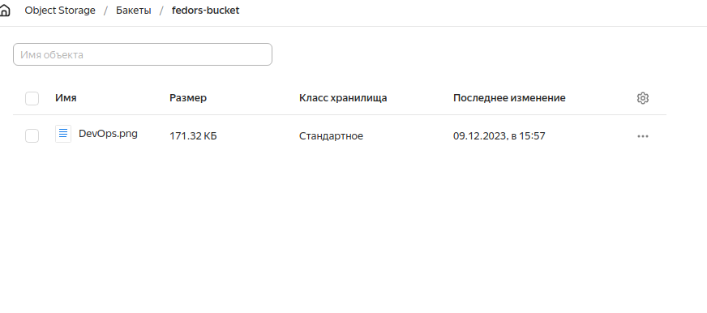

# Решение домашнего задания к занятию «Вычислительные мощности. Балансировщики нагрузки»  

## Задание 1. Yandex Cloud 

**Что нужно сделать**

1. Создать бакет Object Storage и разместить в нём файл с картинкой:

 - Создать бакет в Object Storage с произвольным именем (например, _имя_студента_дата_).
 - Положить в бакет файл с картинкой.
 - Сделать файл доступным из интернета.
 
2. Создать группу ВМ в public подсети фиксированного размера с шаблоном LAMP и веб-страницей, содержащей ссылку на картинку из бакета:

 - Создать Instance Group с тремя ВМ и шаблоном LAMP. Для LAMP рекомендуется использовать `image_id = fd827b91d99psvq5fjit`.
 - Для создания стартовой веб-страницы рекомендуется использовать раздел `user_data` в [meta_data](https://cloud.yandex.ru/docs/compute/concepts/vm-metadata).
 - Разместить в стартовой веб-странице шаблонной ВМ ссылку на картинку из бакета.
 - Настроить проверку состояния ВМ.
 
3. Подключить группу к сетевому балансировщику:

 - Создать сетевой балансировщик.
 - Проверить работоспособность, удалив одну или несколько ВМ.
4. (дополнительно)* Создать Application Load Balancer с использованием Instance group и проверкой состояния.

### Решение

Был создан манифест [storage.tf](src02/storage.tf)  
В манифесте:
- бакет: [fedors-bucket](src02/storage.tf)
- объект (картинка): [DevOps.png](src02/storage.tf)

Результат:

Объект (картинка):


Так же был создан манифест с группой виртуальных машин [compute.tf](src02/compute.tf).  
В манифесте:
- Группа ВМ [front](src02/storage.tf)
- Сетевой балансировщик [network-load-balancer-1](src02/compute.tf)

В файлы **/var/www/html/index.html** на всех ВМ поместил следующий текст:
```
<html></html>
```

Результат:


Балансировщик:


При запросе по адресу сетевого балансировщика выводится картинка:


Проверка работоспособности при удалении одной ВМ:


Но балансировщик по прежнему отвечает:
```
fedor@fedor-X99-F8:~/CODE/Netology/DevOps/clopro-homeworks/src02$ curl 158.160.131.228
<html></html>
fedor@fedor-X99-F8:~/CODE/Netology/DevOps/clopro-homeworks/src02$ 
```

Аналогичная картина при удалении двух ВМ:


```
fedor@fedor-X99-F8:~/CODE/Netology/DevOps/clopro-homeworks/src02$ curl 158.160.131.228
<html></html>
fedor@fedor-X99-F8:~/CODE/Netology/DevOps/clopro-homeworks/src02$ 
```
