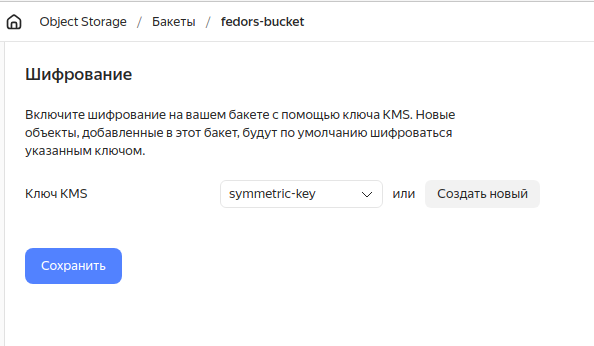
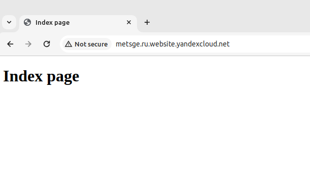
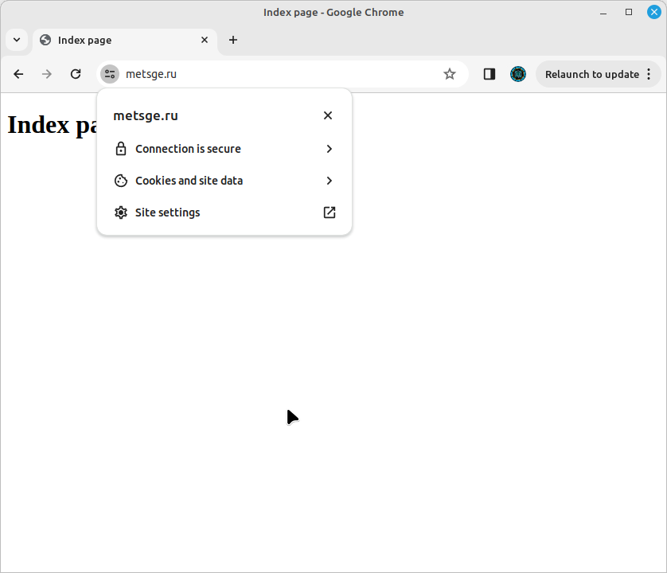

# Решение домашнего задания к занятию «Безопасность в облачных провайдерах»  

## Задание 1. Yandex Cloud   

1. С помощью ключа в KMS необходимо зашифровать содержимое бакета:
 - создать ключ в KMS;
 - с помощью ключа зашифровать содержимое бакета, созданного ранее.

## Решение
- Был создан манифест [kms.tf](src03/kms.tf) с ключём [symmetric-key](src03/kms.tf).  
- Был создан манифест [storage.tf](src03/storage.tf) с бакетом [fedors-bucket](https://github.com/fedor-metsger/clopro-homeworks/blob/b6172a4a4afd6d45975c3cfc408453392ad479d3/src03/storage.tf#L38),
  зашифрованным ключём **key-a**.

Результат:  


2. (Выполняется не в Terraform)* Создать статический сайт в Object Storage c собственным публичным адресом и сделать доступным по HTTPS:

 - создать сертификат;
 - создать статическую страницу в Object Storage и применить сертификат HTTPS;
 - в качестве результата предоставить скриншот на страницу с сертификатом в заголовке (замочек).

## Решение
- Был создан бакет [www.metsge.ru](https://github.com/fedor-metsger/clopro-homeworks/blob/b6172a4a4afd6d45975c3cfc408453392ad479d3/src03/storage.tf#L22),  
  в котором был включен статический вебсайт с начальной страницей в файле [index.html](src03/index.html).

Результат:  



- Затем через WEB-интерфейс был создан сертификат **my-metsge-ru**:
```
fedor@fedor-X99-F8:~/CODE/Netology/DevOps/clopro-homeworks$ yc certificate-manager certificate list
+----------------------+--------------+--------------------------------+---------------------+----------+--------+
|          ID          |     NAME     |            DOMAINS             |      NOT AFTER      |   TYPE   | STATUS |
+----------------------+--------------+--------------------------------+---------------------+----------+--------+
| fpq2u3n21ar1q4sv3ahi | my-metsge-ru | www.metsge.ru,                 | 2024-07-15 18:42:35 | IMPORTED | ISSUED |
|                      |              | autodiscover.metsge.ru,        |                     |          |        |
|                      |              | mail.metsge.ru, owa.metsge.ru, |                     |          |        |
|                      |              | metsge.ru                      |                     |          |        |
+----------------------+--------------+--------------------------------+---------------------+----------+--------+
```
При создании сертификата для защиты статического сайта была создана зона `metsge.ru`:
```
fedor@fedor-X99-F8:~/CODE/Netology/DevOps/clopro-homeworks/src03$ dig metsge.ru

; <<>> DiG 9.18.12-0ubuntu0.22.04.3-Ubuntu <<>> metsge.ru
;; global options: +cmd
;; Got answer:
;; ->>HEADER<<- opcode: QUERY, status: NOERROR, id: 39691
;; flags: qr rd ra; QUERY: 1, ANSWER: 0, AUTHORITY: 1, ADDITIONAL: 1

;; OPT PSEUDOSECTION:
; EDNS: version: 0, flags:; udp: 65494
;; QUESTION SECTION:
;metsge.ru.                     IN      A

;; AUTHORITY SECTION:
metsge.ru.              799     IN      SOA     ns1.yandexcloud.net. mx.cloud.yandex.net. 1 10800 900 604800 900

;; Query time: 0 msec
;; SERVER: 127.0.0.53#53(127.0.0.53) (UDP)
;; WHEN: Fri Dec 15 18:22:57 MSK 2023
;; MSG SIZE  rcvd: 109
```

В зоне была создана запись:
```
fedor@fedor-X99-F8:~/CODE/Netology/DevOps/clopro-homeworks/src03$ dig www.metsge.ru

; <<>> DiG 9.18.12-0ubuntu0.22.04.3-Ubuntu <<>> www.metsge.ru
;; global options: +cmd
;; Got answer:
;; ->>HEADER<<- opcode: QUERY, status: NOERROR, id: 40101
;; flags: qr rd ra; QUERY: 1, ANSWER: 1, AUTHORITY: 0, ADDITIONAL: 1

;; OPT PSEUDOSECTION:
; EDNS: version: 0, flags:; udp: 65494
;; QUESTION SECTION:
;www.metsge.ru.                 IN      A

;; ANSWER SECTION:
www.metsge.ru.          150     IN      A       213.180.193.247

;; Query time: 20 msec
;; SERVER: 127.0.0.53#53(127.0.0.53) (UDP)
;; WHEN: Fri Dec 15 18:23:01 MSK 2023
;; MSG SIZE  rcvd: 58
```
Результат открытия сайта:



