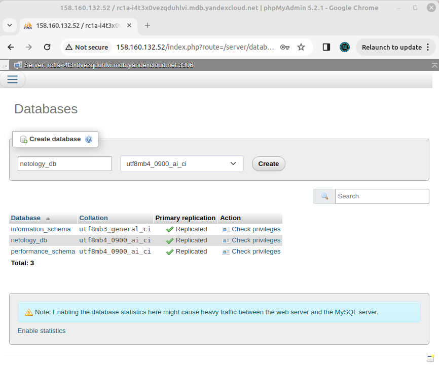

# Решение домашнего задания к занятию «Кластеры. Ресурсы под управлением облачных провайдеров»

## Задание 1. Yandex Cloud

1. Настроить с помощью Terraform кластер баз данных MySQL.

 - Используя настройки VPC из предыдущих домашних заданий, добавить дополнительно подсеть private в разных зонах, чтобы обеспечить отказоустойчивость. 
 - Разместить ноды кластера MySQL в разных подсетях.
 - Необходимо предусмотреть репликацию с произвольным временем технического обслуживания.
 - Использовать окружение Prestable, платформу Intel Broadwell с производительностью 50% CPU и размером диска 20 Гб.
 - Задать время начала резервного копирования — 23:59.
 - Включить защиту кластера от непреднамеренного удаления.
 - Создать БД с именем `netology_db`, логином и паролем.

## Решение

С помощью манифеста [network.tf](src04/network.tf) были созданы приватные подсети:
- [private1](https://github.com/fedor-metsger/clopro-homeworks/blob/ab8775981c81a8cdee798b2e739953665b378595/src04/network.tf#L33)
- [private2](https://github.com/fedor-metsger/clopro-homeworks/blob/ab8775981c81a8cdee798b2e739953665b378595/src04/network.tf#L38)
- [private3](https://github.com/fedor-metsger/clopro-homeworks/blob/ab8775981c81a8cdee798b2e739953665b378595/src04/network.tf#L43)

Был создан манифест [mysql.tf](src04/mysql.tf), содержащий:
- кластер MySQL [cluster01](https://github.com/fedor-metsger/clopro-homeworks/blob/ab8775981c81a8cdee798b2e739953665b378595/src04/mysql.tf#L2);
- базу данных [netology_db](https://github.com/fedor-metsger/clopro-homeworks/blob/ab8775981c81a8cdee798b2e739953665b378595/src04/mysql.tf#L42);
- пользователя [netology_user](https://github.com/fedor-metsger/clopro-homeworks/blob/ab8775981c81a8cdee798b2e739953665b378595/src04/mysql.tf#L47).

Результат:
```
fedor@fedor-X99-F8:~/CODE/Netology/DevOps/clopro-homeworks/src04$ yc managed-mysql cluster list
+----------------------+-----------+---------------------+--------+---------+
|          ID          |   NAME    |     CREATED AT      | HEALTH | STATUS  |
+----------------------+-----------+---------------------+--------+---------+
| c9qeifrh0ltgq3vlk85g | cluster01 | 2023-12-17 19:59:28 | ALIVE  | RUNNING |
+----------------------+-----------+---------------------+--------+---------+
```

2. Настроить с помощью Terraform кластер Kubernetes.

 - Используя настройки VPC из предыдущих домашних заданий, добавить дополнительно две подсети public в разных зонах, чтобы обеспечить отказоустойчивость.
 - Создать отдельный сервис-аккаунт с необходимыми правами. 
 - Создать региональный мастер Kubernetes с размещением нод в трёх разных подсетях.
 - Добавить возможность шифрования ключом из KMS, созданным в предыдущем домашнем задании.
 - Создать группу узлов, состояющую из трёх машин с автомасштабированием до шести.
 - Подключиться к кластеру с помощью `kubectl`.

## Решение

С помощью манифеста [network.tf](src04/network.tf) были созданы публичные подсети:
- [public1](https://github.com/fedor-metsger/clopro-homeworks/blob/ab8775981c81a8cdee798b2e739953665b378595/src04/network.tf#L11)
- [public2](https://github.com/fedor-metsger/clopro-homeworks/blob/ab8775981c81a8cdee798b2e739953665b378595/src04/network.tf#L16)
- [public3](https://github.com/fedor-metsger/clopro-homeworks/blob/ab8775981c81a8cdee798b2e739953665b378595/src04/network.tf#L21)

С помощью манифеста [sa.tf](src04/sa.tf) был создан сервисный эккаунт [k8s-sa](https://github.com/fedor-metsger/clopro-homeworks/blob/ab8775981c81a8cdee798b2e739953665b378595/src04/sa.tf#L3)

Был создан манифест [k8s.tf](src04/k8s.tf), содержащий кластер k8s [netology_k8s](https://github.com/fedor-metsger/clopro-homeworks/blob/ab8775981c81a8cdee798b2e739953665b378595/src04/k8s.tf#L3);

Результат:
```
fedor@fedor-X99-F8:~/CODE/Netology/DevOps/clopro-homeworks$ yc managed-kubernetes cluster list
+----------------------+--------------+---------------------+---------+---------+-------------------------+----------------------+
|          ID          |     NAME     |     CREATED AT      | HEALTH  | STATUS  |    EXTERNAL ENDPOINT    |  INTERNAL ENDPOINT   |
+----------------------+--------------+---------------------+---------+---------+-------------------------+----------------------+
| cat19qce84flm19gd8q8 | netology-k8s | 2023-12-18 07:00:44 | HEALTHY | RUNNING | https://158.160.138.144 | https://192.168.10.7 |
+----------------------+--------------+---------------------+---------+---------+-------------------------+----------------------+
```

В манифесте [k8s.tf](src04/k8s.tf) была создана группа рабочих узлов [k8s-workers](https://github.com/fedor-metsger/clopro-homeworks/blob/ab8775981c81a8cdee798b2e739953665b378595/src04/k8s.tf#L44).

Результат:
```
fedor@fedor-X99-F8:~/CODE/Netology/DevOps/clopro-homeworks$ yc managed-kubernetes node-group list
+----------------------+----------------------+-------------+----------------------+---------------------+---------+------+
|          ID          |      CLUSTER ID      |    NAME     |  INSTANCE GROUP ID   |     CREATED AT      | STATUS  | SIZE |
+----------------------+----------------------+-------------+----------------------+---------------------+---------+------+
| catentujc6fcdfcmjqj1 | cat19qce84flm19gd8q8 | k8s-workers | cl14shlisc2470k6knhh | 2023-12-18 07:10:56 | RUNNING | auto |
+----------------------+----------------------+-------------+----------------------+---------------------+---------+------+
```

Получаем ключи для доступа к кластеру:
```
fedor@fedor-X99-F8:~/CODE/Netology/DevOps/clopro-homeworks$ yc managed-kubernetes cluster get-credentials netology-k8s --external

Context 'yc-netology-k8s' was added as default to kubeconfig '/home/fedor/.kube/config'.
Check connection to cluster using 'kubectl cluster-info --kubeconfig /home/fedor/.kube/config'.

Note, that authentication depends on 'yc' and its config profile 'default'.
To access clusters using the Kubernetes API, please use Kubernetes Service Account.
```

Подключаемся через **kubectl**:
```
fedor@fedor-X99-F8:~/CODE/Netology/DevOps/clopro-homeworks$ kubectl get nodes -A -o wide
NAME                        STATUS   ROLES    AGE   VERSION   INTERNAL-IP     EXTERNAL-IP       OS-IMAGE             KERNEL-VERSION      CONTAINER-RUNTIME
cl14shlisc2470k6knhh-ilos   Ready    <none>   16m   v1.27.3   192.168.10.25   158.160.112.52    Ubuntu 20.04.6 LTS   5.4.0-153-generic   containerd://1.6.21
cl14shlisc2470k6knhh-isow   Ready    <none>   16m   v1.27.3   192.168.10.4    158.160.119.232   Ubuntu 20.04.6 LTS   5.4.0-153-generic   containerd://1.6.21
cl14shlisc2470k6knhh-itij   Ready    <none>   16m   v1.27.3   192.168.10.13   158.160.99.202    Ubuntu 20.04.6 LTS   5.4.0-153-generic   containerd://1.6.21
```

## Дополнительные задания

 - *Запустить микросервис phpmyadmin и подключиться к ранее созданной БД.
 - *Создать сервис-типы Load Balancer и подключиться к phpmyadmin. Предоставить скриншот с публичным адресом и подключением к БД.

## Решение

Был создан манифест [phpmyadmin.tmplt](src04/phpmyadmin.tmplt), содержащий:
- деплоймент [phpmyadmin-deployment](https://github.com/fedor-metsger/clopro-homeworks/blob/ab8775981c81a8cdee798b2e739953665b378595/src04/phpmyadmin.tmplt#L5);
- сервис [phpmyadmin-service](https://github.com/fedor-metsger/clopro-homeworks/blob/ab8775981c81a8cdee798b2e739953665b378595/src04/phpmyadmin.tmplt#L39).

Результат:
```
fedor@fedor-X99-F8:~/CODE/Netology/DevOps/clopro-homeworks/src04$ kubectl --kubeconfig kube.config get pod -o wide
NAME                                     READY   STATUS    RESTARTS   AGE    IP             NODE                        NOMINATED NODE   READINESS GATES
phpmyadmin-deployment-85c575c7bd-45stb   1/1     Running   0          8m6s   10.112.129.4   cl1ajp55hgaqhmp0rslt-esav   <none>           <none>
fedor@fedor-X99-F8:~/CODE/Netology/DevOps/clopro-homeworks/src04$ kubectl --kubeconfig kube.config get svc -o wide
NAME                 TYPE           CLUSTER-IP     EXTERNAL-IP      PORT(S)        AGE     SELECTOR
kubernetes           ClusterIP      10.96.128.1    <none>           443/TCP        42m     <none>
phpmyadmin-service   LoadBalancer   10.96.178.10   158.160.132.52   80:32455/TCP   8m14s   app=phpmyadmin
fedor@fedor-X99-F8:~/CODE/Netology/DevOps/clopro-homeworks/src04$
```

Скриншот подключения через браузер:

